# RitikChawla197

> Memorable developer positioning.

**Theme:** GitHub · **Style:** Creative · **Agent:** Full-Stack Engineer

## Header
Hi, I'm **RitikChawla197**. This README is tuned for **personal brand** with a GitHub visual system.

  

  

## Heatmap
Animated year-long contribution calendar, rendered terminal-style.

  

> ⚠️ Placeholder data for now — see setup note below to wire this up to your real GitHub contributions.

## GitHub Stats
GitSkins stat widgets will use the **GitHub** theme.

  <picture>
    <source media="(prefers-color-scheme: light)" srcset="https://www.gitskins.com/api/section/stats?username=RitikChawla197&theme=github-dark&mode=light" />
    
  </picture>

## Projects
Highlights repositories as proof of work.

  <picture>
    <source media="(prefers-color-scheme: light)" srcset="https://www.gitskins.com/api/section/projects?username=RitikChawla197&theme=github-dark&mode=light" />
    
  </picture>

## Connect
Contact and social links will appear here.

  <picture>
    <source media="(prefers-color-scheme: light)" srcset="https://www.gitskins.com/api/section/social?username=RitikChawla197&theme=github-dark&mode=light" />
    
  </picture>

<!-- Sections: Header, Heatmap, GitHub Stats, Projects, Connect -->
